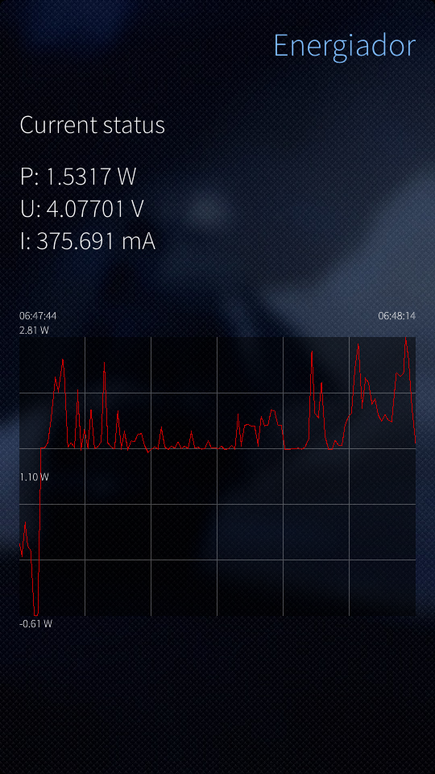
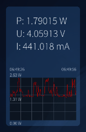
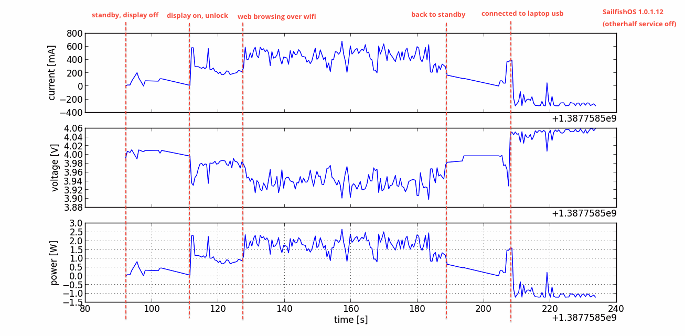

Energiador
==========

A simple energy draw meter for the Jolla phone / SailfishOS. It is currently 
a very crude hack, that just displays current energy draw and a history
graph of max. 120 previous data points. 

There are some issues when the device is in standby; the QTimer does not
fire every 250ms, but much more rarely. This is probably due to 
aggressive power saving mode in Jolla / Sailfish. I do not yet know how to work
around this.

Comments, ideas and contributions are welcome.

License
-------

The code (including scripts) is placed under MIT license by Jussi Sainio.

Screenshots
-----------

Notes
-----

QtBatteryInfo_ can be used to view the same information, but this comes over
DBus at irregular intervals at least in SailfishOS 1.0.1.12 (Laadunjärvi),
and current draw just shows 0 mA for most of the time. (See QtSystemInfo `qml-battery example`_)

.. _QtBatteryInfo: http://doc.qt.digia.com/qtmobility-1.2/qml-batteryinfo.html#details
.. _`qml-battery example`: https://qt.gitorious.org/qt/qtsystems/source/f632aee809fed2e96c7f4ed598ed7615a008d9b1:examples/systeminfo/qml-battery

It is possible to use command "upower -d" to figure out the correct sysfs paths
for the energy sensors both on the Jolla phone and Sailfish SDK emulator.
On the device, the power information can be directly read from sysfs path
``/sys/devices/platform/msm_ssbi.0/pm8038-core/pm8921-charger/power_supply/battery/``, e.g. ``current_now`` and ``voltage_now``.

Standby mode is still a challenge, since timers do not fire when they are
supposed to. (This affects also the Python script below.)

I want power history logs now!
------------------------------

Ok, the app is not there yet, but it is simple enough to write a Python script
for collecting data over time and graphing it later. A sample script
is provided under ``/scripts/energymeasure.py``.

Just enable Developer mode on the phone, move the script on the phone 
(e.g. using scp) and run 
  
  ::

  $ pkcon install python
  $ python energymeasure.py > log.csv

Then, move the log.txt to a computer with python + numpy + matplotlib installed,
and run

  ::

  $ python plotcsv_energy log.csv

This produces a plot of the energy consumption over time. 

This example picture is produced by the above-mentioned script, running
in ``screen`` on Jolla phone running SailfishOS 1.0.1.12. The other half daemon
(known to have `a power drain problem`_ in this version) was turned off 
with ``systemctl stop tohd.service``.

.. _`a power drain problem`: http://www.jollatides.com/2013/12/23/source-of-battery-drain-nfc-always-on-solution/
